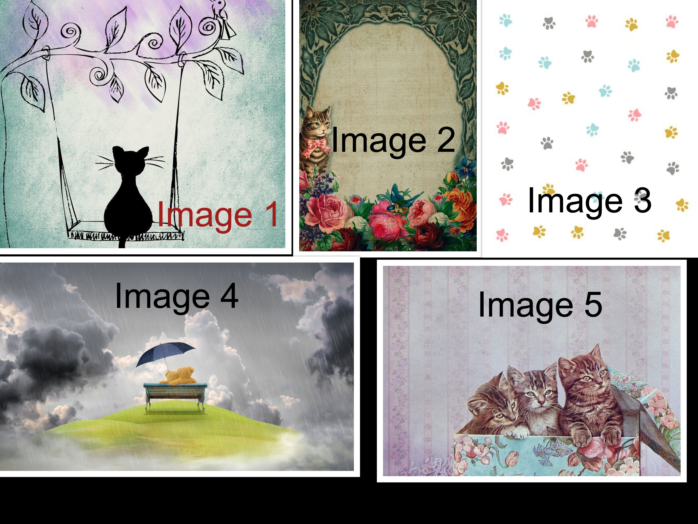
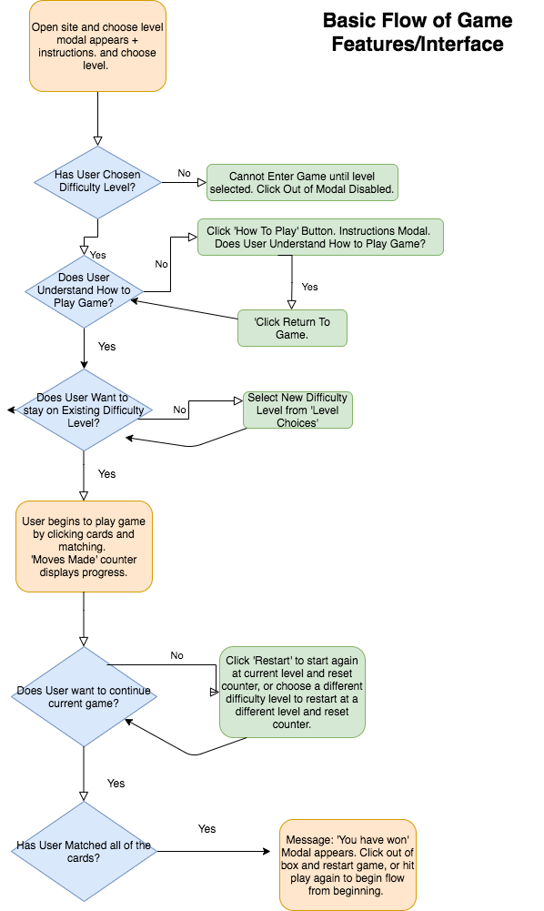

# Cat-Matched
## A Card Matching Game for adults who like cats, a quick laugh and relaxation.

Cat-Matched is an easy to use, intuitive card-matching memory game aimed at older adults with minimal IT skills who like cats and want something easy and functional to play with. The game can also be enjoyed by younger adults who like cats and are looking for a quick, easy-to-play game that requires minimum skill and will break through the mundanity of their every-day lives.

# **UX**
___
## **Project Goals**

The goal of Cat-Matched is to be a quick and relaxing break in an otherwise boring or stressful day. The game should feel like an escape. The target audience is older adults and young professionals.

## **Player Goals**

The main audience for this game is older adults who like cats with minimum IT skills who want something which is easy to understand and navigate.

* To relax and decompress.
* To have a sense of achievement.
* To play something easy and funny.
* Playing something that is functional and simple. No complex rules or navigation, or good IT skills needed.
* To have a clear goal, which is quick and easy to achieve.
* To be visually stimulated.

These goals were addressed in the following way:

* Cat-Matched has a relaxing visual interface. The background picture, colour scheme and layout inspire a relaxing, calming feeling.
* The rules of the game are simple and there are just the right amount of cards so that it's easy to win but not so easy that it gets boring. The Moves counter keeps track of the number of moves made, so the player can compare their score each time and challenge themselves if they'd like.
* There are three difficulty levels, so the player can increase or decrease cards depending on how much they'd like to be challenged.
* The game has a minimum amount of buttons and elements, all of which are laid out clearly. The navigation is simple, clear and intuitive and the rules for the game are clearly and succinctly laid out and accessible at all times, even during game-play.
* The cat-cards are cute and a little bit quirky. The game should have an element of being a bit funny and amusing, so humorous images of cat illustrations were meticulously selected in order to bring a smile to the player's face.
* The background and colour scheme of the game are visually appealing and clean in order to both relax and inspire the player. 

## **Developer and Business Goals**

My goals as a developer are as follows:

* To build a project using clean and concise Vanilla Javascript, in order to familiarise myself with the basics of the language without frameworks.
* To have well thought out programming that anticipates a person's lack of IT trouble-shooting skills, as the target audience is senior citizens.
* To have a project that stands out both visually and functionally in my portfolio.

## **User Stories**

As an older adult with minimum IT skills (who likes cats), I want:

* To be able to understand the rules of the game quickly, and to have access to the rules whenever I don't remember without massively interrupting my game-play.
* To not have to go through too many menu options or a complicated interface to reach the game. Minimum clicks possible.
* To have an interface that isn't too fancy and doesn't have lots of animations. I want something functional, as I just want to play my game.
* To have some measure of how I'm doing in the game in comparison to the last round, but nothing too stressful.
* To be able to challenge myself, maybe with higher difficulty levels.
* To smile when I turn each card over, because the image is cute and I want to see cats.
* To have the option to know who made the game and contact them if need be.

### **Design Choices**

The Cat-Matched game was designed to be a game that would be enjoyed by older adults and people who like cats. This could include younger people who like cats, and design choices were made keeping that in mind.

Choices were also made based on a design hierarchy, where the boldest element on the page should be the game-cards, followed by the titles & buttons, and then the boxes for the 'Moves Made' and 'Level Choice' containers. Colors and background-images were selected with this in mind. 

**Fonts**

* Initially the font selected for all the text was *Lora* from Google Fonts as this created an elegant, gentle feeling that aligns with the aim of appealing to older adults.
* A design choice made at a later point was to change the font of the Title from *Lora* to **Josefin Sans** in order to create more contrast and make the title stand out more. This helped to divide the titles of the sections as well as adding additional visual appeal.

**Background Images**

    

It was important when creating the design for the Cat-Matched game that the game be visually appealing but not too overpowering. The goal was to promote a feeling of calm whilst also catering to an older audience. The above 5 images were selected from https://pixabay.com/ based on how they fit into the design goals, and assessed accordingly. As is clear from the git commit history, the background image was changed a few times and different options were tested. Below I have outlined how each picture was assessed, and why picture 4 was chosen in the end:

* Image one: This image has muted colors and connects with the theme of a game about cats. It definitely fits into the design aims. However, it did not translate well onto larger screen sizes and the picture looked grainy, which is why it was not selected.
* Image two: This image has a beautiful vintage feel to it and it the flower border framed the cards beautifully on a smaller screen size. Its older, rustic mood also caters towards an older client, as per the design aims. However, like image one, it looked grainy and unprofessional on larger screen sizes.
* Image three: This image was the simplest of the five and was chosen because of its simplicity and how this would in turn draw attention to the game play board. The colors, however, did not appeal to a more mature audience and the mood was more for a teenage girl, which is why it was not selected.
* Image four: The main problem encountered when testing the images was their responsiveness. This image not only has a beautiful, calming feel to it, but it also looked good on larger screen sizes. It isn't so complex that it overpowers the game and takes away from the game-board, but instead draws the eye to the game-board which is why it was selected in the end. Of the 5, it most fit the design aims.
* Image five: This image was tested alongside image two based on its vintage feel. However, although the image is beautiful it overpowered the game-play board, which is not great from a User Experience Perspective.

The developer felt that Image four best fit the design brief. Below I outline how the colors and styling were subsequently selected to complement the background and draw attention when needed. 

**Colors & Styling**

The background image was first selected and then ran through the site https://www.colorcodepicker.com/ . This site identified the primary colors in the background image, and these were added to https://mycolor.space/. Different palettes were generated using the palette generating tool, and eventually the following palettes and gradients were chosen:

* Game Card Background:

    

The focal point of the game should be the cards, which is why a gradient background was chosen which comprises of the colors above. It was identified that the target user would prefer gentler, less invasive colors, which is why a more neutral color scheme that invoked a sense of calm was selected. 

A few bolder colors were added for emphasis and to ensure that the game-play foreground was elevated above the background image. It was important for the game-cards to be the boldest and most colorful on the page, as they are the highest point in the hierarchy and the focus of the program.

* Game-card Images

* Titles

    

* The main title and the titles for the 'Moves Made' section and 'Level Choice' section comprised of the above gradient. This was chosen as it was elevated enough over the foreground but not so much that it looked garish.

* Borders and a slight shadown were added to the titles to emphasise them and elevate them over the background. It was important for the user aims of the game being functional that they stand out.

* It is important that the user can get where they need to get to ASAP and that the game is intuitive, hence the extra emphasis added to titles. 

    

* A gentler gradient hue which harmonised with both the title and background image was used for the boxes of 'Moves Made' and 'Level Choice'. This was in order to complement the hierarchy, where the boldest colors are the game cards and the least bold as the containers. 

### **Features**

**Game Flow**

There are three modals in the game. On the first modal, there are three buttons. On the game-play board, there are 5 buttons and on each subsequent modal there is a button that allow you to return to the game.

Below is a Flowchart that outlines and summarises the overall game-play, and how the modals and buttons facilitate the user's interaction with the game and make for a smooth experience:

    

